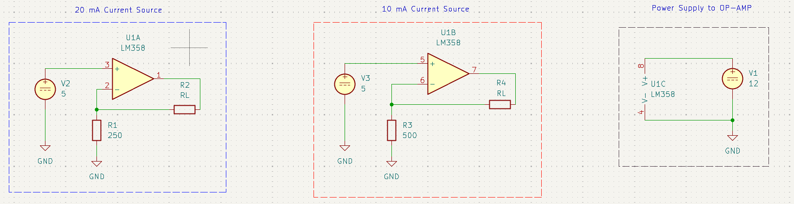

# [LM358 Based Current Source]
A fixed current source of 10 mA and 20 mA implemented using LM358 OP-AMP.

---

## Key Specifications

### 10 mA Fixed Current Source

| Parameter                   | Value / Range |
| :-------------------------- | :------------ |
| **Input Voltage Supply**    | 12 V DC       |
| **Load Current **           | 10 mA         |
| **Output Voltage Range**    | 0 - 5 V       |
| **Maximum Load Resistance** | 515 $\Omega$  |

### 25 mA Fixed Current Source

| Parameter                   | Value / Range |
| :-------------------------- | :------------ |
| **Input Voltage Supply**    | 12 V DC       |
| **Load Current **           | 20 mA         |
| **Output Voltage **         | 0 - 5 V       |
| **Maximum Load Resistance** | 251 $\Omega$  |

##  Schematic

---

## Simulation

DC Analysis

---

##  Results

Two fixed current sources implemented using dual op-amps (LM358)

### Final Results

| Parameter          | Expected (Calc) | Expected (Sim) | Actual (Measured) |
| :----------------- | :-------------- | :------------- | ----------------- |
| Load Current       | 10 mA           | 10 mA          | 10.2 mA           |
| Compliance Voltage | 5.39 V          | 5.7 V          | 5.25 V            |
| Maximum Load       | 539 $\Omega$    | 570 $\Omega$   | 515 $\Omega$      |

| Parameter          | Expected (Calc) | Expected (Sim) | Actual (Measured) |
| :----------------- | :-------------- | :------------- | ----------------- |
| Load Current       | 20 mA           | 20.01 mA       | 20.4 mA           |
| Compliance Voltage | 5.39 V          | 5.49 V         | 5.12 V            |
| Maximum Load       | 269.5 $\Omega$  | 274 $\Omega$   | 251 $\Omega$      |
**Conclusion:** - The mini project was Successful.
- **Key Inference:** Using only one LM358 IC, two current sources can be implemented. The maximum output voltage of the op-amp is lower than the supply voltage as LM358 is not a rail-rail op-amp. As a result, the compliance voltage is lower than expected if considering the full swing to the rail by the op-amp.  

---
