# Design: 

Schematic:

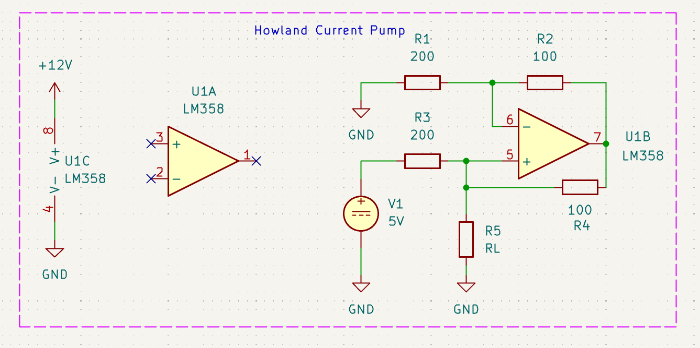

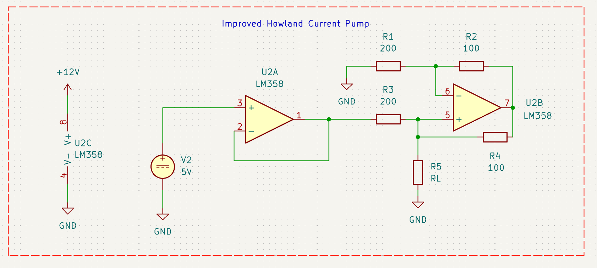

Both are fixed current sources of 25 mA.
The 2nd design has much better input impedance.

Calculated Parameters:
Compliance Voltage = 6.93 V 
Maximum Load = 277 Ω
Maximum Input Impedance (Initial design at maximum load voltage) = 5.128 kΩ
Minimum Input Impedance (Initial design at minimum load voltage) = 200 Ω
Input Impedance (Improved design) = Input Impedance of voltage follower

Note: Initial design refers to the Howland current pump with no buffer for the reference voltage.
Whereas, the improved design refers to the Howland Current Pump with buffer for the reference voltage.

# Simulation:

Load Current vs Load Resistance (Initial Design)

Load Current vs Load Resistance (Improved Design)

Here, the compliance voltage turned out to be much less. After some digging, I found that LM358 can only supply up to 20-30 mA and due to the small feedback resistors, the current in the feedback loop was high enough to limit the current in the remaining loops. Thus, to overcome this, either we increase the feedback resistance, but this would lower the compliance voltage (dependency on feedback resistor ratio), or we can swap out LM358 for another op amp which can supply more current. I decided to design a lower value current source of 5 mA. This provides me a much higher compliance voltage and solves the above problem.

# Updated Design

Updated Schematic: 

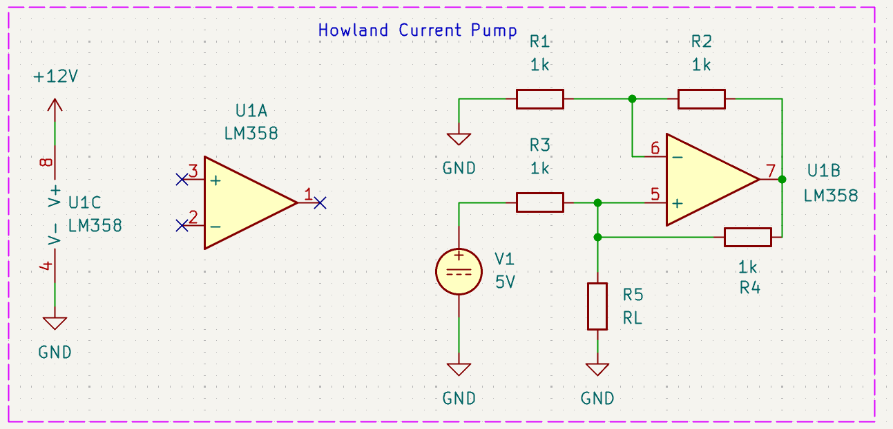

Both are fixed current sources of 5 mA
Calculated Parameters:
Compliance Voltage = 5.195 V 
Maximum Load = 1039 Ω
Maximum Input Impedance (Initial design at maximum load voltage) = 25.64 kΩ
Minimum Input Impedance (Initial design at minimum load voltage) = 1 kΩ
Input Impedance (Improved design) = Input Impedance of voltage follower

# Simulation

DC Analysis

Load Current vs Load Resistance (Initial Design)

Load Current vs Load Resistance (Improved Design)

Output Voltage vs Load Resistance (Initial Design)

Output Voltage vs Load Resistance (Improved Design)

Load Current vs Internal Resistance of Voltage Reference for a load of 100 Ω (Initial Design)

Load Current vs Internal Resistance of Voltage Reference for a load of 100 Ω (Improved Design) 

Load Current vs Internal Resistance of Voltage Reference for varying loads (Initial Design)

Load Current vs Internal Resistance of Voltage Reference for varying loads (Improved Design)

We observe that the initial design has a very poor input impedance. As the internal resistance of voltage reference source increases, the attenuation of the reference voltage increases which decreases the load current. The input impedance is also dependent on the load, as the load resistance decreases the input impedance also decreases. Due to the poor input impedance and dependency on internal resistance of source and load resistance, the design should be improved by adding a buffer. Thus, the reference voltage is given through a voltage follower and the input impedance here is equal to the input impedance of voltage follower. This improves the input impedance significantly and the mitigates the attenuation due to the internal resistance and also eliminates the dependency on load resistance.

# Bench Testing

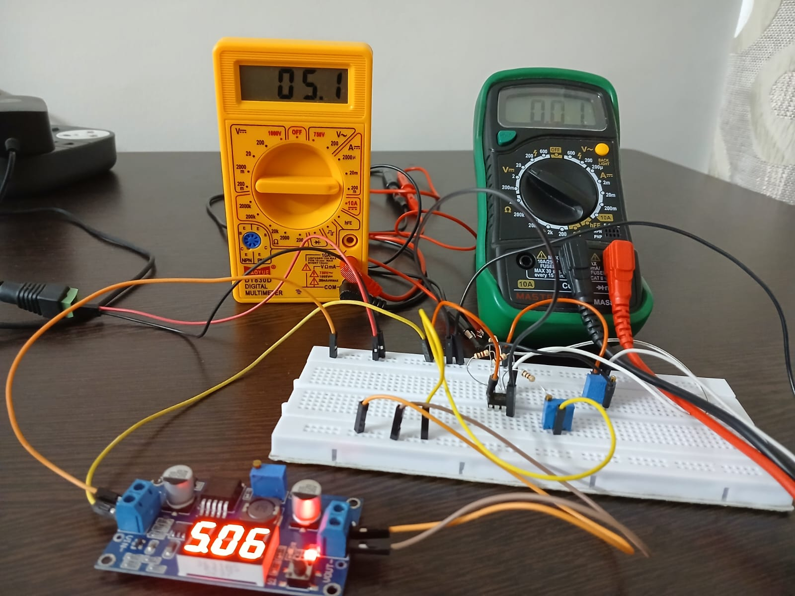
Load current with no load (Initial Design)

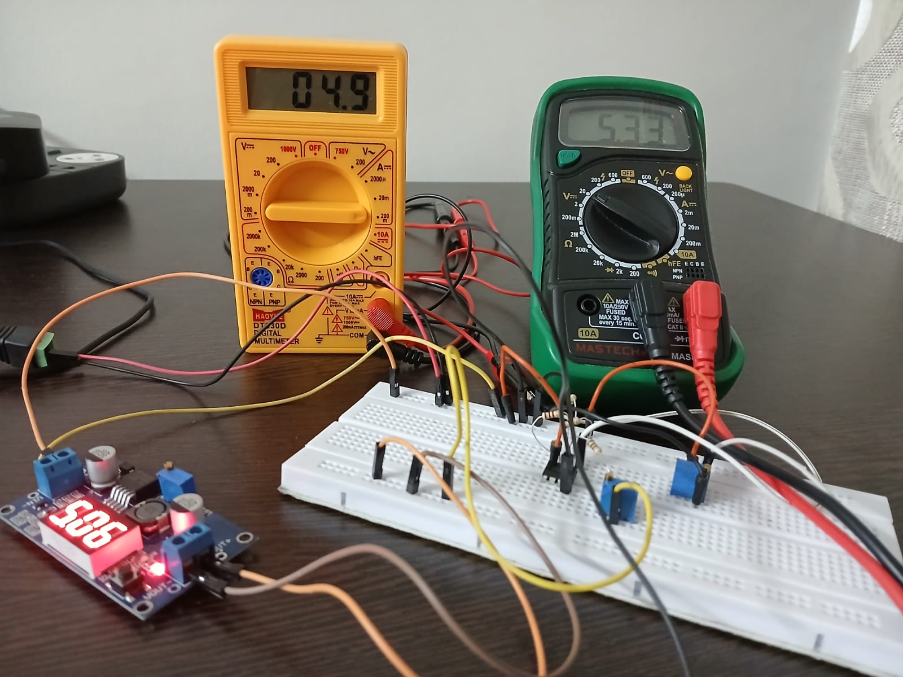
Load current with maximum load resistance (Initial Design)

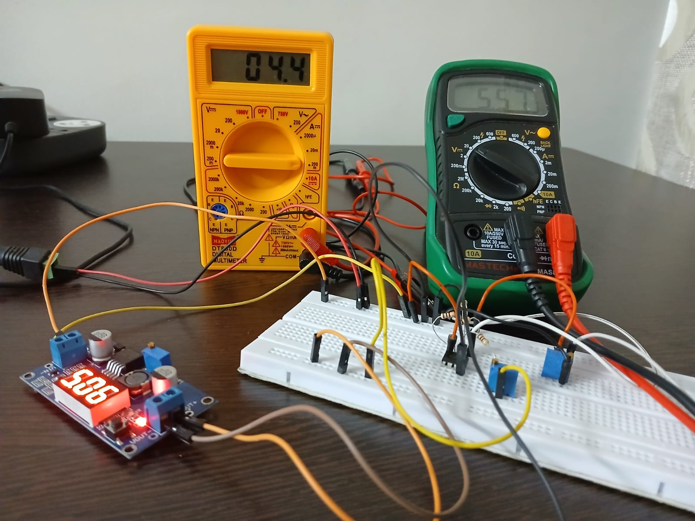
Load Current when the load resistance has crossed the maximum threshold (Initial Design)

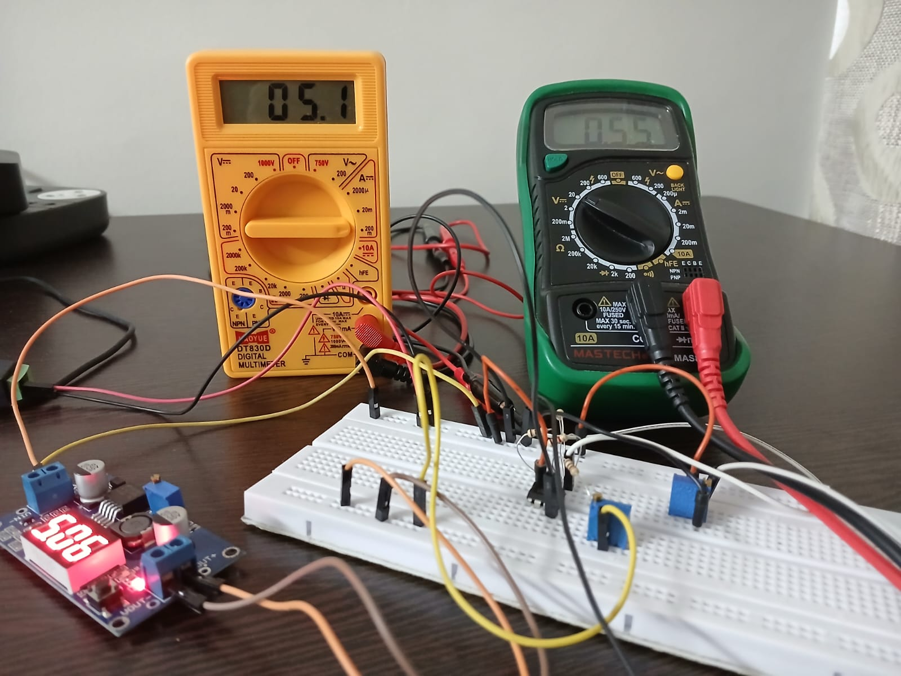
Load Current when the load resistance is equal to 100 Ω  (Initial Design)

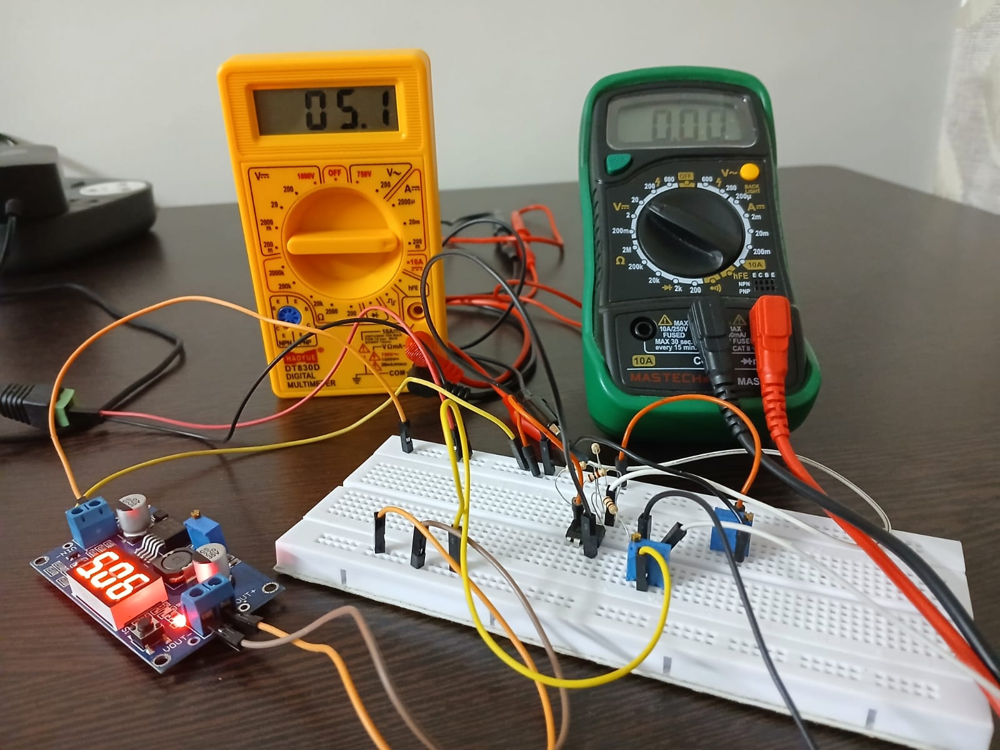
Load Current when internal resistance of voltage reference source is 0 Ω (Initial Design)

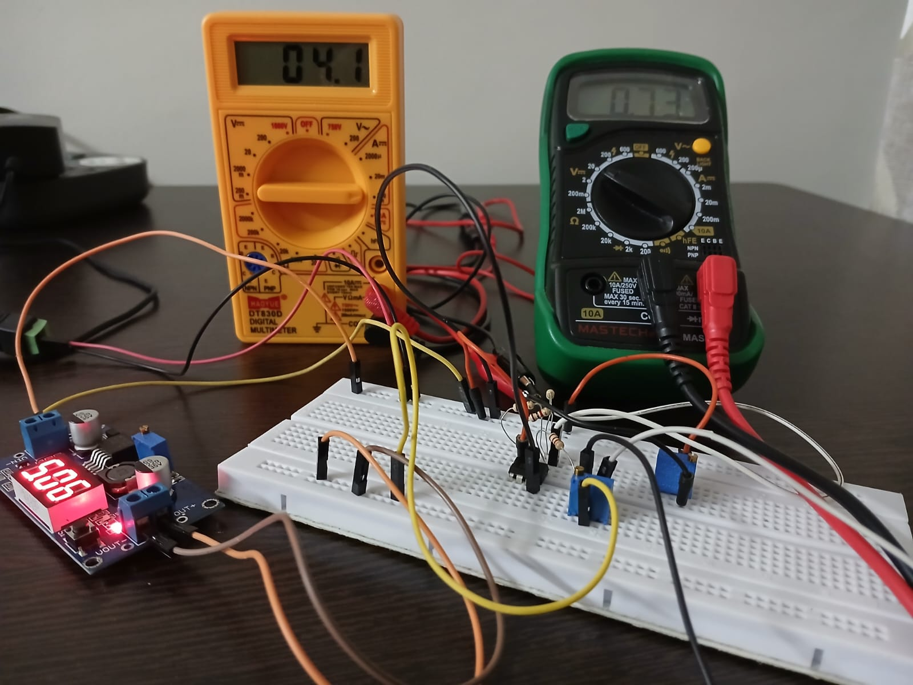
Load Current when series resistance of voltage reference source is increased (Initial Design)

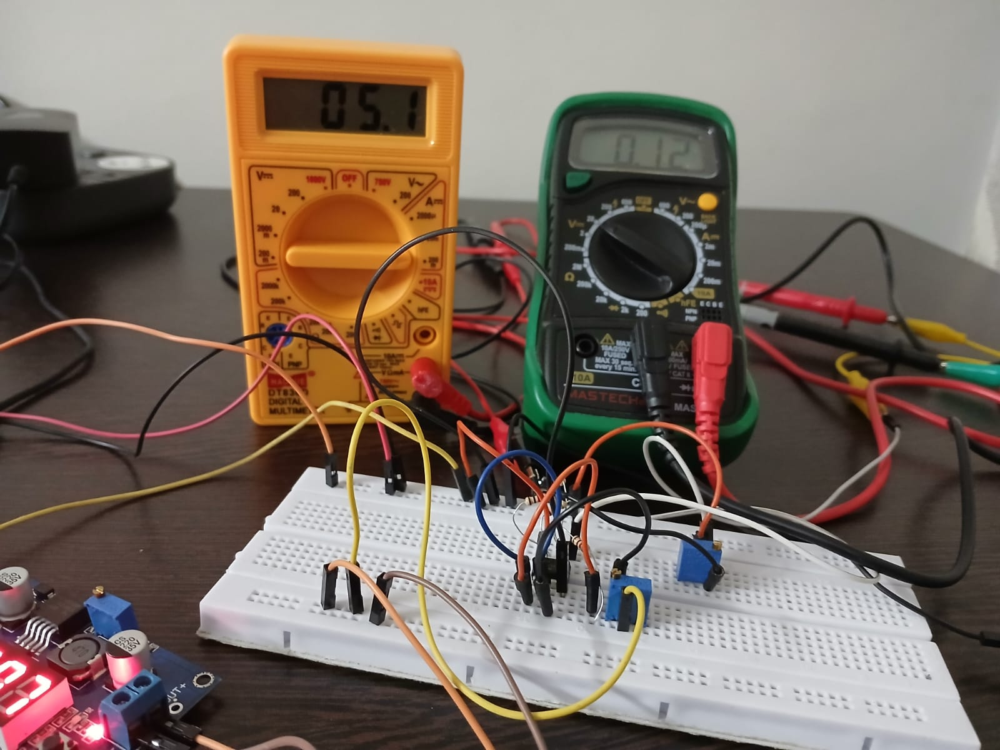
Load current with no load (Improved Design)

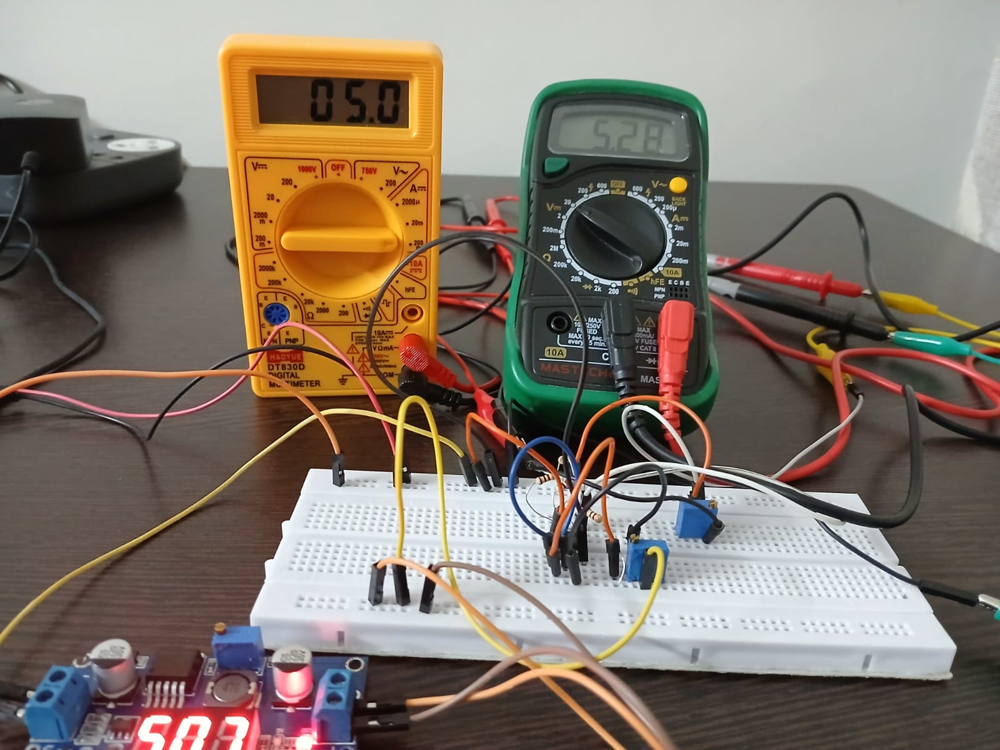
Load current with maximum load resistance (Improved Design)

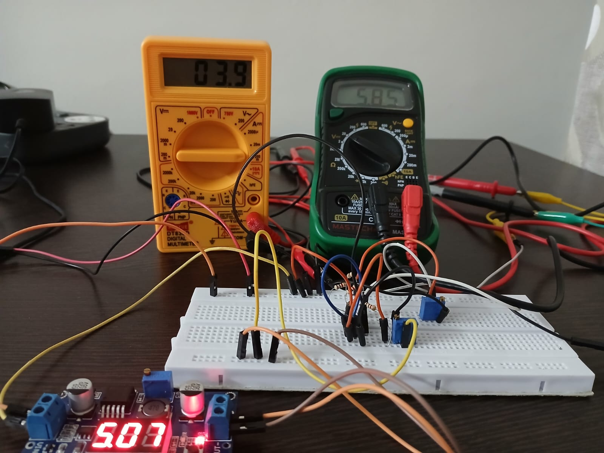
Load current when load resistance has crossed the maximum limit (Improved Design)

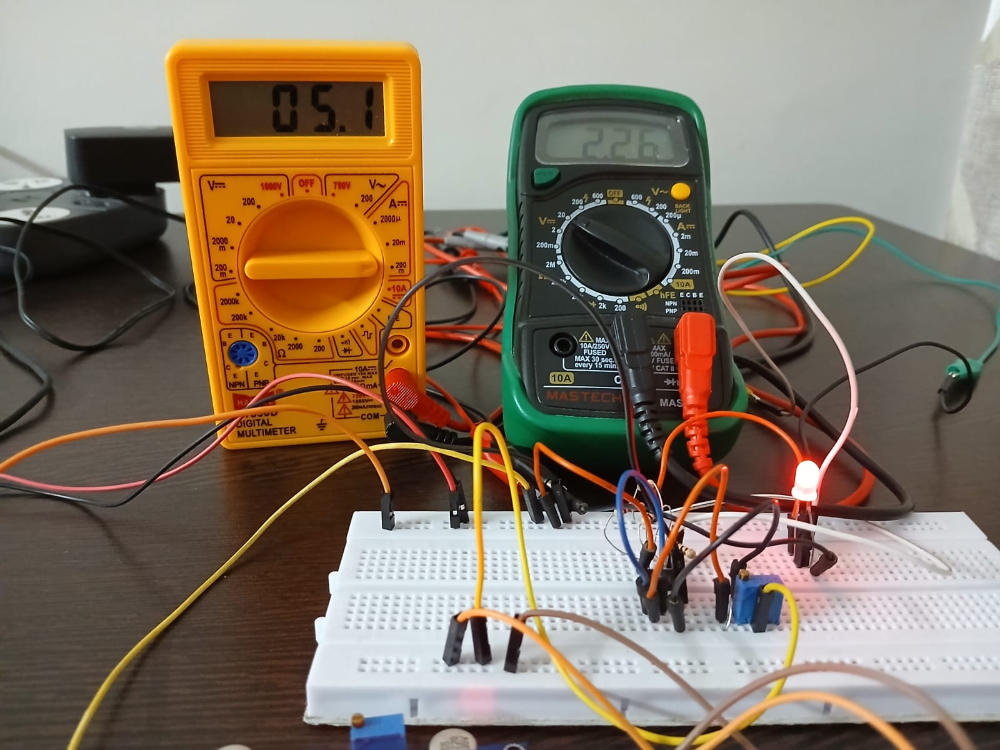
Load current when led is a load

Here, a pot was used to act as internal resistance for the voltage reference source.
# Results

### 5 mA Initial Design
Load Current = 5.1 mA
Compliance Voltage = 5.3 V 
Maximum Load Resistance= 1.039 kΩ
Input Impedance = very low

### 5 mA Improved Design
Load Current = 5.1 mA
Compliance Voltage = 5.3 V 
Maximum Load Resistance= 1.039 kΩ
Input Impedance = very high

