# Design

Schematic

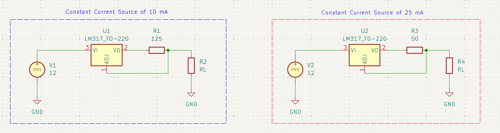

$R_{\text{sense}}$ = 125 Ω (Load Current = 10 mA)

$R_{\text{sense}}$ = 50 Ω (Load Current = 25 mA)

Calculated Parameters:
Compliance Voltage = 7.75 V (For load current of 10 mA and 25 mA)
Maximum Load for load current of 10 mA = 775 Ω
Maximum Load for load current of 25 mA = 310 Ω

This is assuming voltage drop across LM317 is 3 V (minimum drop out voltage from datasheet), so the compliance voltage and maximum load calculated is conservative.

# Simulations

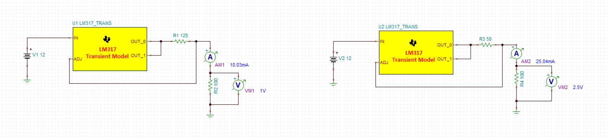
DC Analysis

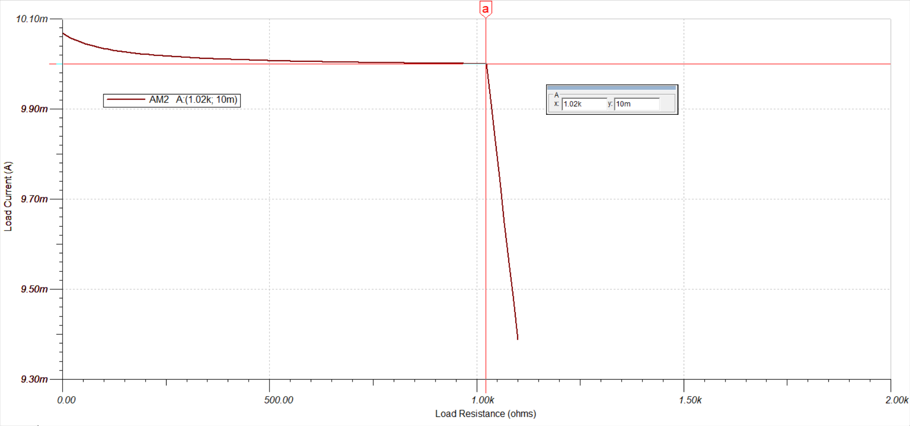
Load Current Vs Load Resistance (10 mA Design)

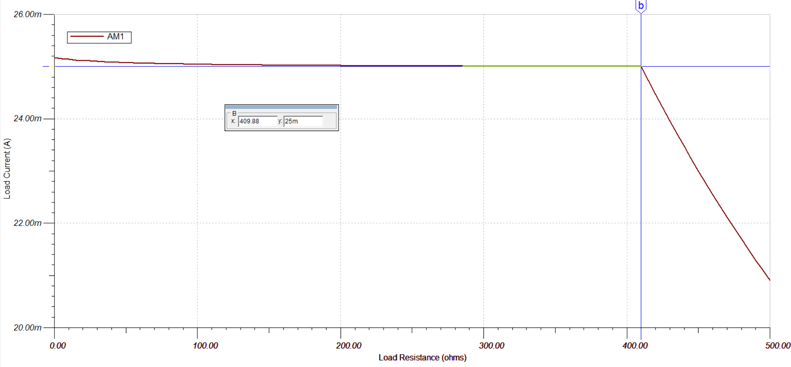
Load Current Vs Load Resistance (25 mA Design)

Here, the maximum load which can be placed is 1.02 kΩ and 410 Ω for the 10 mA and 25 mA designs respectively after which load current no longer remains constant. This is higher than the calculated maximum load for both the designs, this is because the voltage drop across LM317 is not actually 3 V and it is lower than expected. The dropout voltage of LM317 is dependent on the load current and it can be lower than 3 V for small load currents like 10 mA (according to datasheet).

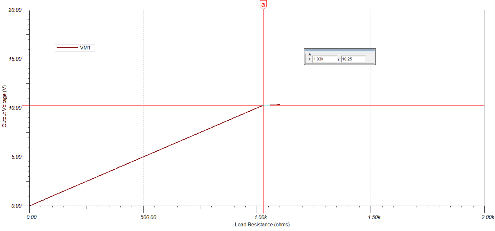
Output Voltage vs Load Resistance (for 10 mA design)

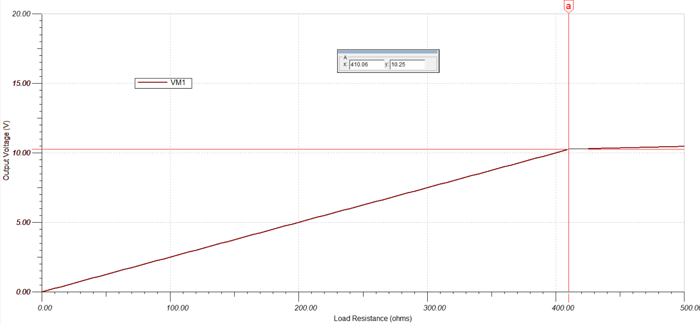
Output Voltage vs Load Resistance (for 25 mA design)

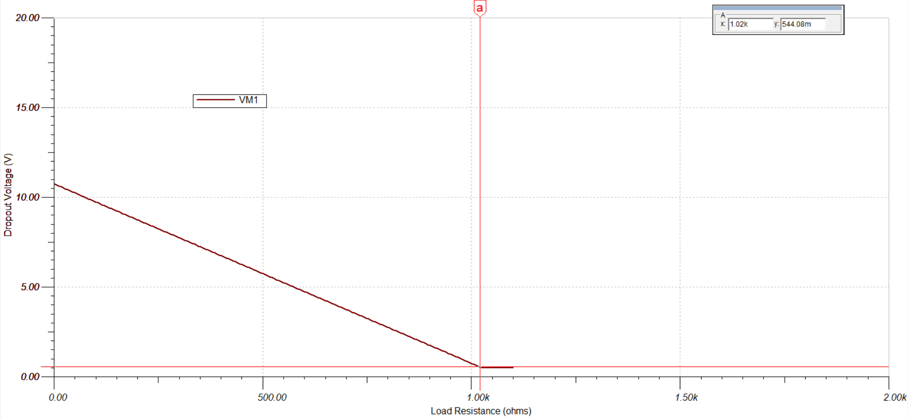
Dropout Voltage vs Load Resistance (for 10 mA design)

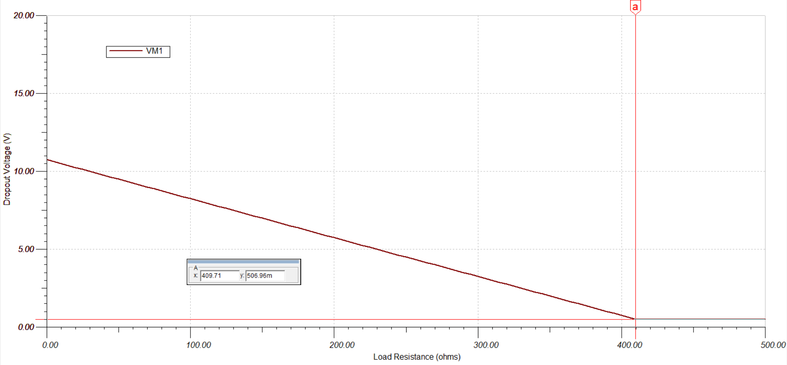
Dropout Voltage vs Load Resistance (for 25 mA design)

Here, as the load resistance increases, the dropout voltage decreases linearly up to 0.5 V after which it saturates at the maximum load resistance for both designs.

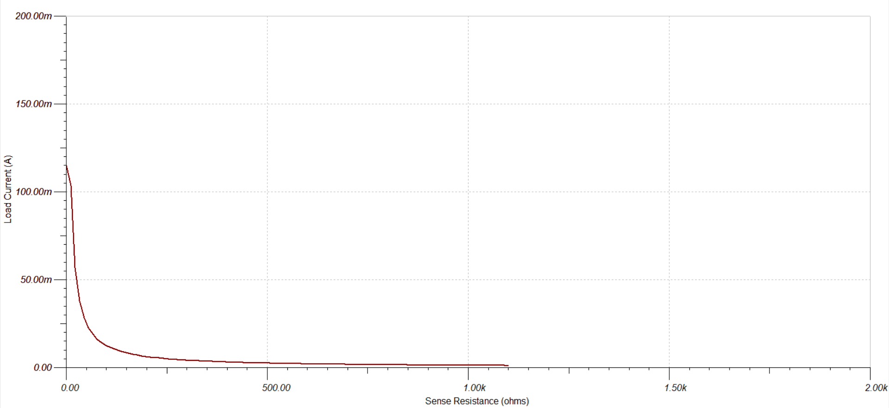
Load Current vs Sense Resistance (for 10 mA design)

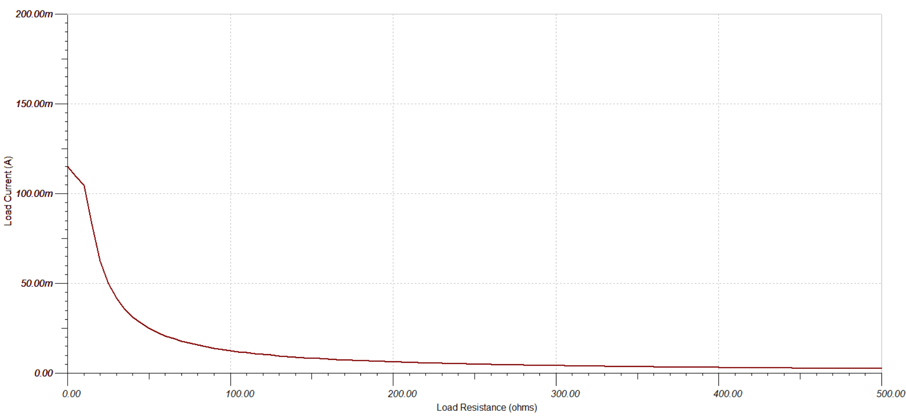
Load Current vs Sense Resistance (for 25 mA design)

The initial part of the curve is linear due to the output voltage being very close to the input voltage (result of larger load currents at lower sense resistance). Majority of the curve is hyperbolic as expected.

# Bench Testing and Debugging

### 10 mA Design

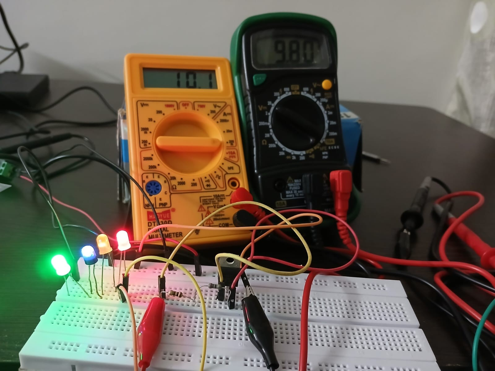
Current Source with 4 LEDs as load

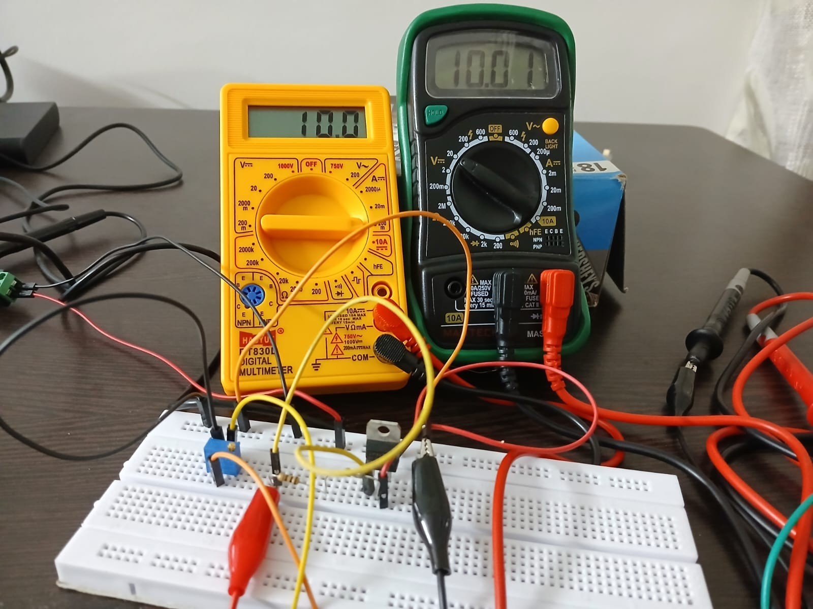
Load Current (left multimeter) and Output Voltage (right multimeter) with Maximum Load Resistance

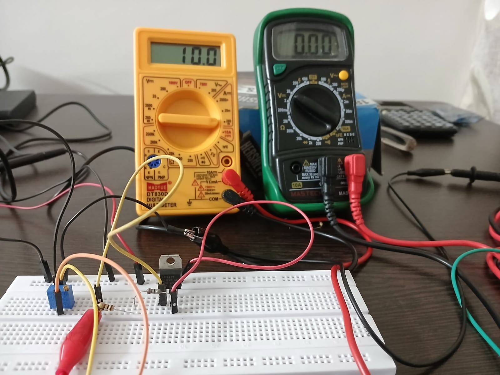
Load Current (left multimeter) and Output Voltage (right multimeter) with Minimum Load Resistance (No Load/Short)

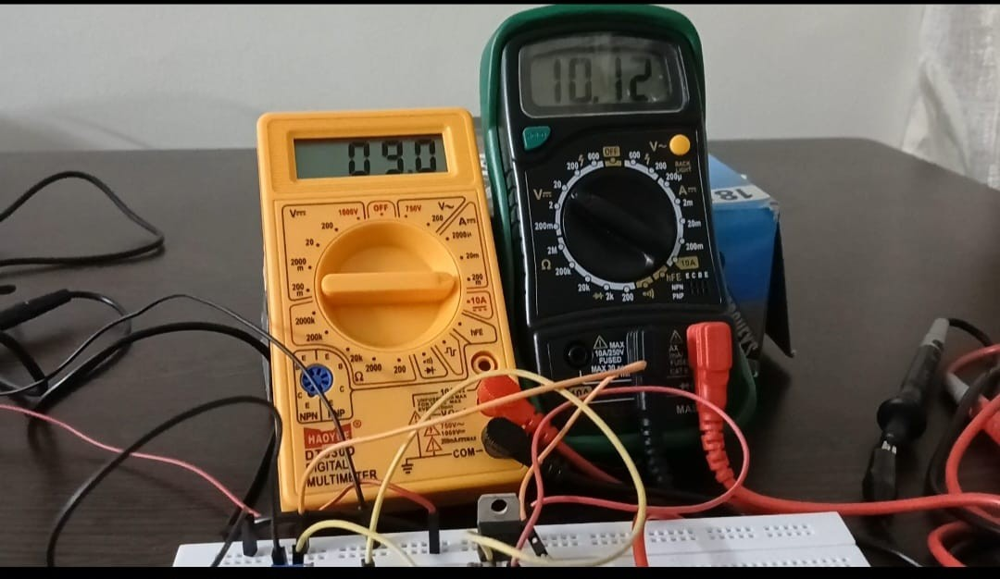
Load Current (left multimeter) and Output Voltage (right multimeter) when load has crossed the maximum limit

### 25 mA Design

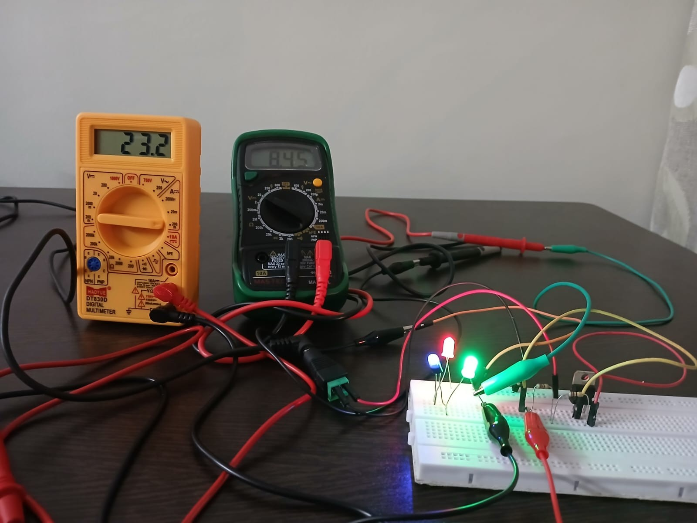
Current Source with 3 LEDs as load

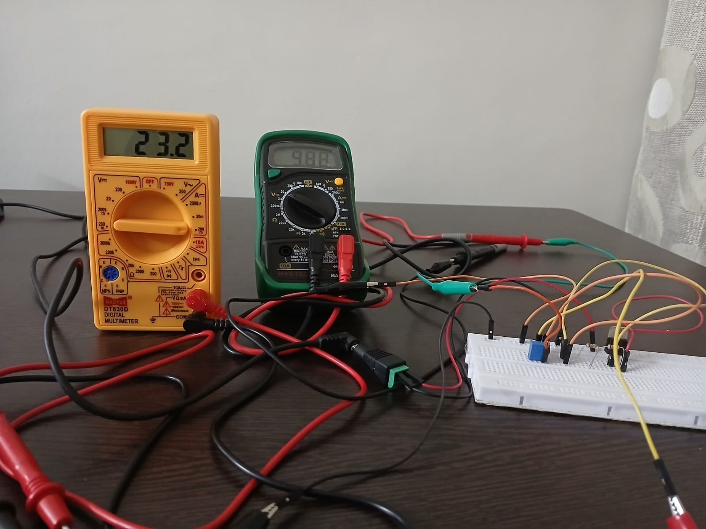
Load Current (left multimeter) and Output Voltage (right multimeter) with Maximum Load Resistance

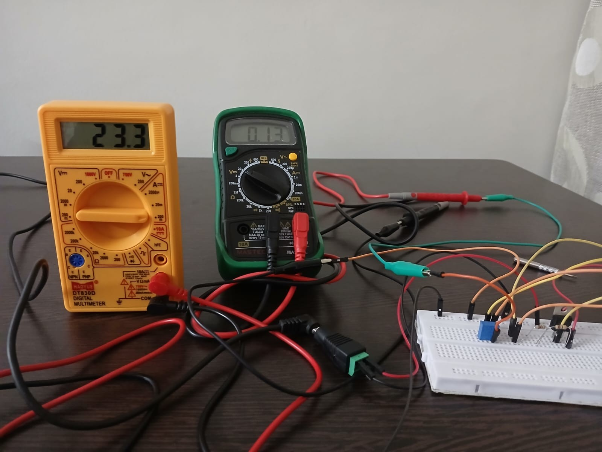
Load Current (left multimeter) and Output Voltage (right multimeter) with Minimum Load Resistance (No Load/Short)

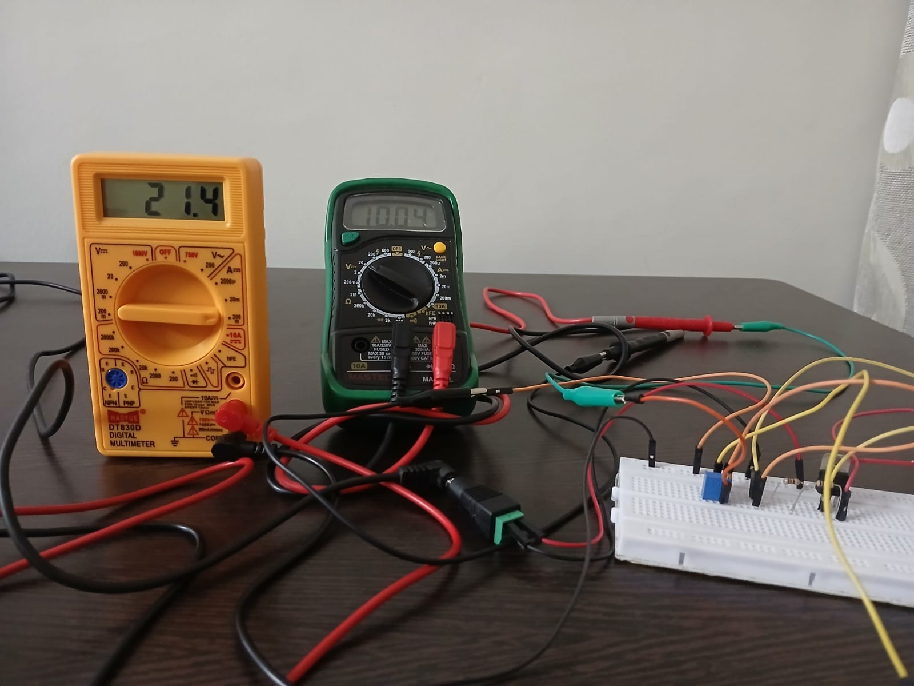
Load Current (left multimeter) and Output Voltage (right multimeter) when load has crossed the maximum limit

# Results 

### 10 mA Design
Load Current = 10.1 mA
Compliance Voltage = 10.01 V 
Maximum Load Resistance= 1 kΩ

### 25 mA Design
Load Current  = 23.3 mA
Compliance Voltage = 9.88 V 
Maximum Load Resistance = 424 Ω

The designed current source worked as expected. The 10 mA design provided a stable 10.1 mA and the 25 mA design provided a stable 23.3 mA (error due to sense resistor tolerance). The current in both designs remained constant for varying loads. The compliance voltage for the 10 mA design came out around 10 V and for the 25 mA design came out around 9.9 V. The compliance voltage came out much higher than the calculated one, but it was slightly lower as compared to the simulations (10.25 V). This can be explained by the low dropout voltage of LM317 at low load currents. Maximum Load for 10 mA design is 1 kΩ and for 25 mA design is 424 Ω
