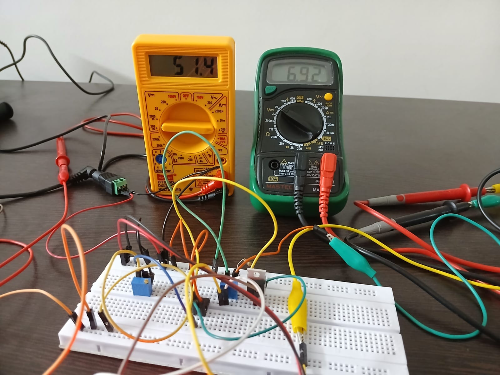
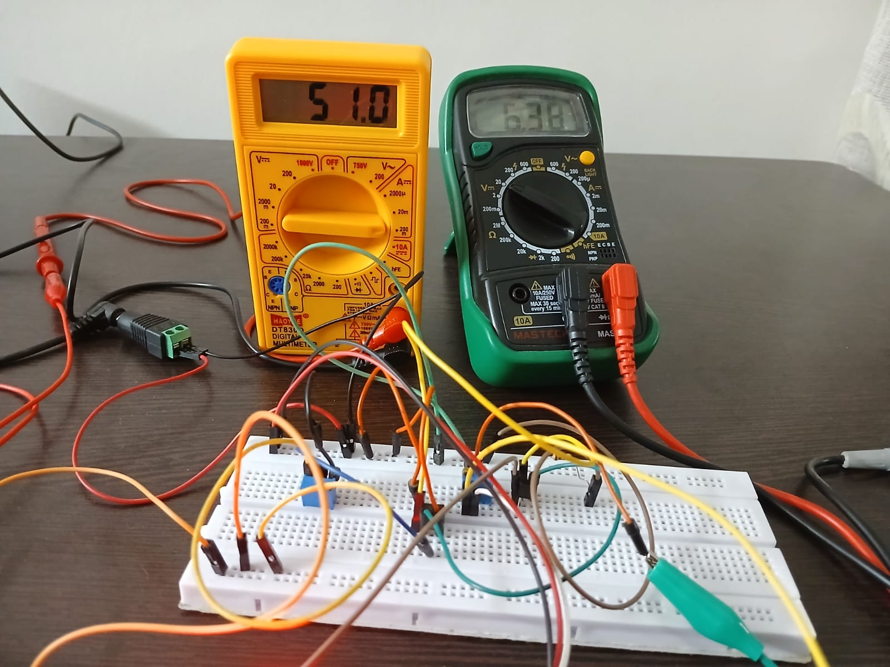

# [Voltage Controlled Current Source]
A adjustable current source (i.e., voltage controlled current source) with maximum load current of 50 mA was implemented using LM358 OP-AMP and pass transistor.

---

## Key Specifications

| Parameter                   | Value / Range |
| :-------------------------- | :------------ |
| **Input Voltage Supply**    | 12 V DC       |
| **Reference Voltage**      | 0 - 5 V       |
| **Maximum Load Current**   | 50 mA         |
| **Minimum Load Current**   | 0 mA          |
| **Output Voltage Range**    | 0 - 7 V       |
| **Maximum Load Resistance** | 140 $\Omega$  |

##  Schematic

---

## Simulation

DC Analysis

---

##  Results

Maximum output voltage at maximum load current of 50 mA using IRLZ44N as pass transistor

Maximum output voltage at maximum load current of 50 mA using BC547 as pass transistor

### Final Results

### Implementation using BC547 as pass transistors

| Parameter                                                                           | Expected (Calc) | Expected (Sim) | Actual (Measured) |
| :---------------------------------------------------------------------------------- | :-------------- | :------------- | ----------------- |
| Load Current Range                                                                  | 0 - 50 mA       | 0 - 50 mA      | 0 - 51.2 mA       |
| Compliance Voltage                                        (at Maximum Load Current) | 7 V             | 6.79 V         | 6.38 V            |
| Maximum Load (at Maximum Load Current)                                              | 140 $\Omega$    | 136 $\Omega$   | 125 $\Omega$      |
### Implementation using IRLZ44N as pass transistors

| Parameter                                                                           | Expected (Calc) | Expected (Sim) | Actual (Measured) |
| :---------------------------------------------------------------------------------- | :-------------- | :------------- | ----------------- |
| Load Current Range                                                                  | 0 - 50 mA       | 0 - 50 mA      | 0 - 51.4 mA       |
| Compliance Voltage                                        (at Maximum Load Current) | 7 V             | 6.93 V         | 6.92 V            |
| Maximum Load (at Maximum Load Current)                                              | 140 $\Omega$    | 136 $\Omega$   | 135 $\Omega$      |

**Conclusion:** - The mini project was Successful.

---
